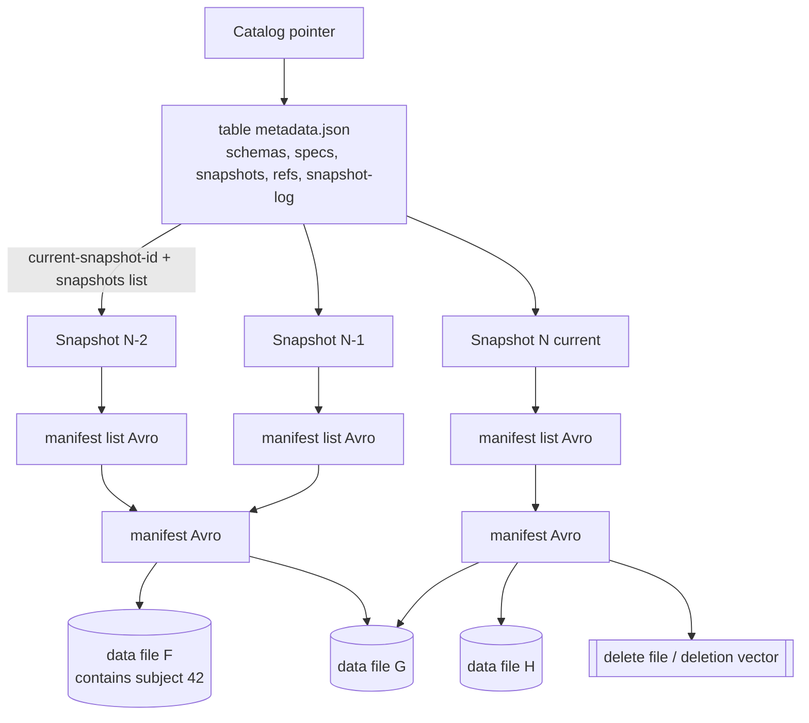
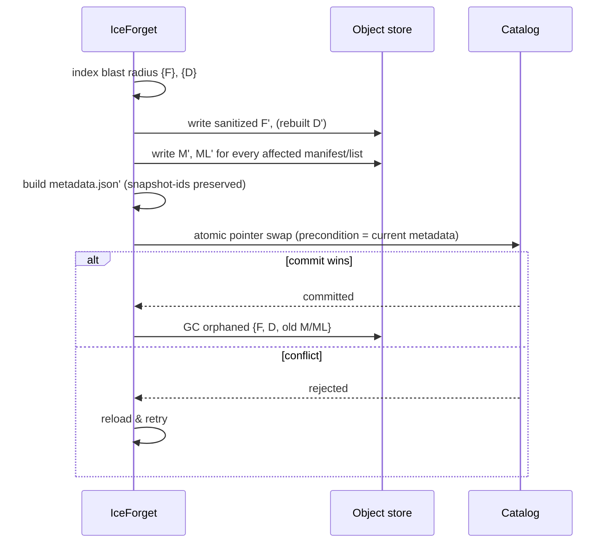

# RFC 0001: Surgical History Rewrite

- **Status:** Discussion
- **Author(s):** 대홍 (@JeonDaehong)
- **Created:** 2026-07-20
- **Discussion:** (open a companion issue and link it here)
- **Supersedes / Superseded by:** —

## Summary

Erase a subject's rows from **every** snapshot of an Iceberg table while keeping
the table's time-travel history navigable. After a surgical rewrite, you can
still time-travel to any historical snapshot id or timestamp and read the table
*as it was* — except the erased subject is no longer present in any of them, and
never was, physically.

This is the capability that distinguishes IceForget from the standard
"`DELETE` → compact → expire" pipeline, which satisfies erasure only by
**destroying** history down to a retention budget (see the MVP in
[`coordinator.py`](../../src/iceforget/coordinator.py)). This RFC proposes how to
satisfy erasure while **preserving** history.

## Motivation

Iceberg's snapshot model is a compliance liability *and* an operational asset.
Regulators (GDPR Art. 17, CCPA, Korea PIPA) require that a subject's personal
data be erased. Iceberg's data teams simultaneously depend on time travel for
reproducibility, audits, incremental reads, and rollback.

The MVP forces a choice: to erase, you expire history, and time travel dies with
it. That is often unacceptable — a table's 90-day audit window, an ML training
snapshot reference, or a regulatory retention obligation on *non-PII* columns
can all require that older snapshots remain readable. Today the only way to keep
history *and* erase a subject is a bespoke, manual metadata-rewrite that almost
no team can safely perform. There is no tool. That gap is the whole reason
IceForget exists.

## Goals / Non-goals

**Goals**

- Physically remove a subject's rows from all data (and delete) files reachable
  from any snapshot in the table.
- Preserve time-travel semantics: every pre-existing `snapshot-id` and its
  `timestamp-ms` remain resolvable, the snapshot log and lineage remain intact,
  and reading any snapshot returns the same rows as before **minus** the erased
  subject.
- Preserve all non-subject data exactly (no collateral deletion, no changed
  row order guarantees beyond what Iceberg already provides).
- Produce a verifiable proof (0 residual rows across all snapshots) and an
  erasure certificate recording `method = surgical-rewrite`.
- Be a single atomic catalog commit — either the whole table is sanitized or
  nothing changes.

**Non-goals**

- Erasing copies outside the table (backups, external exports, downstream
  systems). Out of scope; called out in the certificate.
- Preserving byte-for-byte identical *files* (paths and stats necessarily
  change). We preserve *logical* time-travel, not physical file identity.
- Legal advice on whether history-preserving erasure is "sufficient" in a given
  jurisdiction. IceForget provides a technical measure; interpretation is the
  operator's.
- v1 format tables. We target Iceberg format **v2 and v3**.

## Background: the Iceberg metadata tree

To rewrite history we must understand exactly what a snapshot points at.

Key facts that make this hard:

1. **Snapshots are immutable and content-addressed.** A snapshot references a
   manifest-list *file*; manifests reference data/delete *files* by path plus
   column statistics. Nothing about an existing snapshot is meant to change.
2. **Files are shared across snapshots.** Data file `F` written in snapshot
   `N-2` is typically still referenced (as an `existing` entry) by later
   snapshots until it is compacted or deleted. Erasing `F`'s subject rows
   therefore affects every snapshot that reaches `F`.
3. **There is no first-class "rewrite history" operation** in the Iceberg spec.
   Normal writes only append new snapshots; they never alter old ones.
4. **v2 merge-on-read** means a subject may be present in a data file but
   logically removed by a positional/equality delete file in a later snapshot,
   yet still physically present when you time-travel to the earlier snapshot.
5. **v3** adds deletion vectors, **row lineage** (`_row_id`, `first_row_id`,
   `added_snapshot_id`), and a table **encryption** spec — all relevant below.

## Design

We propose two complementary methods. An operator (via policy) chooses per
table. Both end in a single atomic catalog commit and the same verification.

### Method A — Metadata surgery (physical rewrite)

Rewrite the affected files, then rebuild the minimal slice of the metadata tree
so that historical snapshots point at sanitized files, **preserving their
`snapshot-id`, `sequence-number`, and `timestamp-ms`**.

**Algorithm (per erasure request):**

1. **Index (reuse [`indexer.py`](../../src/iceforget/indexer.py)).** For the
   subject predicate, compute the set of data files `{F}` and delete files
   `{D}` that any snapshot reads the subject from — the blast radius.
2. **Rewrite affected files.** For each `F`, write `F' = F − subject rows`,
   recomputing record count and column bounds. For each affected delete file
   `D`, drop entries that targeted the now-absent rows (they become moot). Under
   v3, preserve `first_row_id`/row-lineage fields on `F'` so `_row_id` values of
   surviving rows are unchanged. Files that don't shrink to empty keep their
   partition tuple; empty results are dropped entirely.
3. **Rebuild manifests.** For every manifest `M` that had an entry for a
   rewritten file, write `M'` replacing that entry's path/stats with the
   sanitized file (or dropping it if empty), preserving entry `status`
   (`added`/`existing`) and the data `sequence_number` so merge-on-read ordering
   is unchanged.
4. **Rebuild manifest lists.** For every manifest list `ML` that referenced a
   rewritten `M`, write `ML'` pointing at `M'`, preserving per-manifest
   summaries (added/existing/deleted counts adjusted for the removed rows).
5. **Rewrite table metadata.** Produce a new `metadata.json` in which each
   affected snapshot's `manifest-list` field points at its `ML'`. **Keep every
   `snapshot-id`, `parent-snapshot-id`, `sequence-number`, `timestamp-ms`,
   `schema-id`, and the `snapshot-log`/`refs` unchanged.** Add an erasure marker
   to each rewritten snapshot's `summary` (e.g.
   `iceforget.erased-request-id = <id>`) for auditability.
6. **Commit atomically.** Swap the catalog metadata pointer in one commit
   (REST catalog `updateTable` with the expected current metadata as the
   precondition; Glue/HMS via their atomic pointer swap). On conflict, abort and
   retry from step 1.
7. **Garbage-collect** the orphaned original files `{F, D}` once no metadata
   references them.

**Why this preserves time travel.** Time travel resolves a `snapshot-id` or
timestamp to a snapshot entry, then follows its manifest-list. Because we keep
the ids and timestamps and only re-point the manifest-list to an equivalent tree
over sanitized files, `SELECT ... FOR VERSION AS OF <id>` returns the same rows
as before, minus the subject. The snapshot log still lists every historical id.

**Cost.** Proportional to the blast radius (files touched), not table size. A
subject confined to a few files rewrites a few files plus the manifests/lists on
the path to them — not the whole table.

### Method B — Crypto-shredding (logical rewrite)

For tables that adopt the Iceberg **v3 table encryption** spec, encrypt PII
columns (or whole rows) with a per-subject or per-key-group data key wrapped by
a KMS (AWS KMS / GCP KMS / Vault). Erasure = destroy the key. The ciphertext
remains physically present in every snapshot but is permanently unreadable,
which many DPAs accept as erasure.

This sidesteps rewriting immutable metadata entirely — history is untouched;
only key material dies. It requires the encryption to have been configured
*before* the data was written, so it is a **forward-looking** mode, whereas
Method A is **retroactive** (works on data already written in the clear).

This RFC scopes the *interface* for Method B (it shares the policy `mode:
crypto-shred` and the certificate) but defers its detailed design to a
follow-up RFC once the v3 encryption story in PyIceberg matures.

### Recommendation

- Offer **Method A** as the retroactive answer for existing v2/v3 tables with
  cleartext PII — this is the hard, novel capability and the focus of
  implementation.
- Offer **Method B** as the forward-looking answer for new v3 tables that can be
  encrypted from the start, and as the cleaner long-term posture.
- Policy selects per table; the certificate records which method was used.

## Correctness & verification

The existing [`Verifier`](../../src/iceforget/verifier.py) already scans every
reachable snapshot for residual rows. Surgical rewrite adds two more
post-commit assertions before a certificate is issued:

1. **Erased:** residual subject rows across all snapshots == 0 (existing check).
2. **Time travel preserved:** the set of `{snapshot-id, timestamp-ms}` after the
   commit is identical to a snapshot manifest captured before it. No id or
   timestamp was added, dropped, or altered.
3. **No collateral loss:** for a sample of snapshots, `count(*) after ==
   count(*) before − (subject rows in that snapshot)`. Optionally verify a
   content digest of non-subject rows for a stronger guarantee.

Any assertion failing marks the run `residual-detected`/`integrity-failed` and
the certificate records it. Because the commit is atomic, a failed run leaves
the table untouched.

## Compatibility

- **Format v2:** supported, including merge-on-read (positional/equality
  deletes). Phase 2 (below).
- **Format v3:** supported; deletion vectors and row lineage are handled, and
  row-lineage lets us track a subject across compactions precisely. Phase 3.
- **Catalogs:** REST first (atomic `updateTable` precondition is the cleanest
  fit), then Glue/HMS. The commit must be a compare-and-swap; catalogs without
  atomic pointer swap are unsupported for Method A.
- **Engines:** rewriting a single Parquet data file minus rows is feasible in
  pure Python via PyArrow, so small blast radii need no cluster. Rewriting Avro
  manifests/manifest-lists requires manifest-writer access; the initial
  implementation may lean on Spark actions (or PyIceberg internals as they
  stabilize), exposed behind the existing
  [`Engine`](../../src/iceforget/engines/base.py) protocol.

## Risks & open questions

- **Snapshot immutability is a spec grey area.** Rewriting the tree behind
  existing snapshot ids is not a sanctioned Iceberg operation. We argue RTBF is
  a legitimate, narrow exception, executed atomically and recorded in an audit
  certificate — but this belongs on `dev@iceberg.apache.org`, and that
  discussion is itself part of IceForget's incubation story. **Open:** should we
  instead mint *new* snapshot ids and provide an id-translation map, trading
  exact-id preservation for spec conformance?
- **Readers holding old metadata/manifest paths** (cached planning, in-flight
  queries, external tools that pinned a `metadata.json`) may still reach orphaned
  files until GC and cache expiry. **Open:** define a safe GC delay and document
  the caching caveat.
- **Concurrent writers.** A competing commit between index and commit invalidates
  the rewrite; we rely on the catalog precondition and retry. High-write tables
  may need a bounded retry / quiesce window.
- **Branches and tags.** Erasure must sanitize files reachable from *all* refs,
  not just `main`, or a tag could resurrect the subject. The blast radius must
  enumerate every ref.
- **Equality deletes** can implicitly reference a subject by predicate; verifying
  their post-state needs care.
- **Legal sufficiency of Method B** varies by jurisdiction (crypto-shredding is
  ThoughtWorks "Trial", not universally accepted). The tool stays neutral.

## Alternatives considered

- **Expire-only (the MVP).** Simple and already shipped, but destroys time
  travel. This RFC exists precisely to avoid that.
- **Mint new snapshots instead of rewriting ids.** Spec-cleaner, but breaks
  external references to historical ids and complicates "the history looks
  unchanged" guarantee. Captured as an open question above.
- **Tombstone / masking views.** A view that filters the subject out hides but
  does not erase — the data is still physically present, so it fails RTBF.
- **Full table rewrite.** Correct but O(table size); wasteful when a subject is
  confined to a few files. Method A is the blast-radius-scoped version.

## References

- Apache Iceberg Table Spec — snapshots, manifests, manifest lists, sequence
  numbers, format v2/v3.
- Iceberg v3: deletion vectors, row lineage (`_row_id`, `first_row_id`),
  table encryption spec.
- Iceberg REST Catalog spec — `updateTable` with requirement preconditions
  (compare-and-swap commits).
- ThoughtWorks Technology Radar — crypto-shredding.
- GDPR Art. 17 (right to erasure); CCPA; Korea PIPA.
